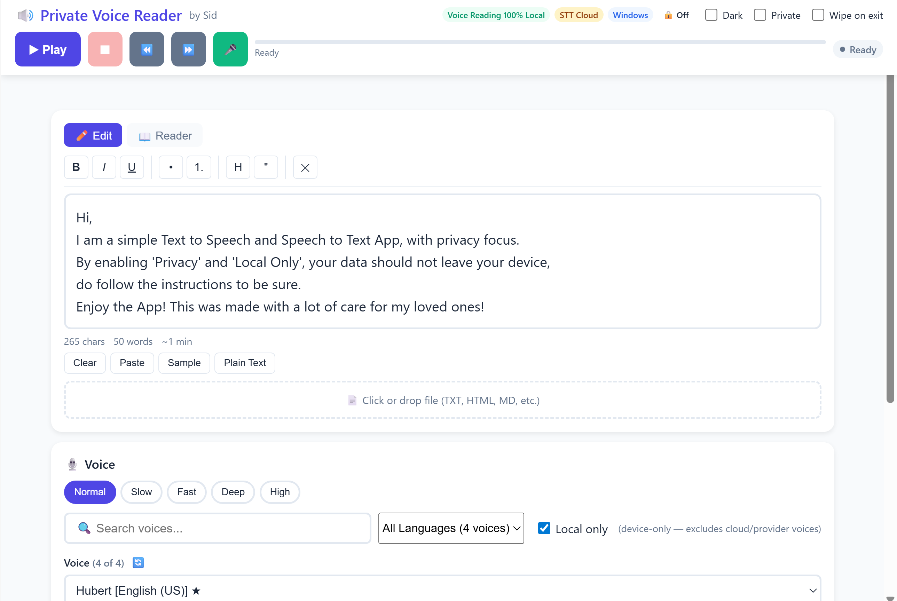
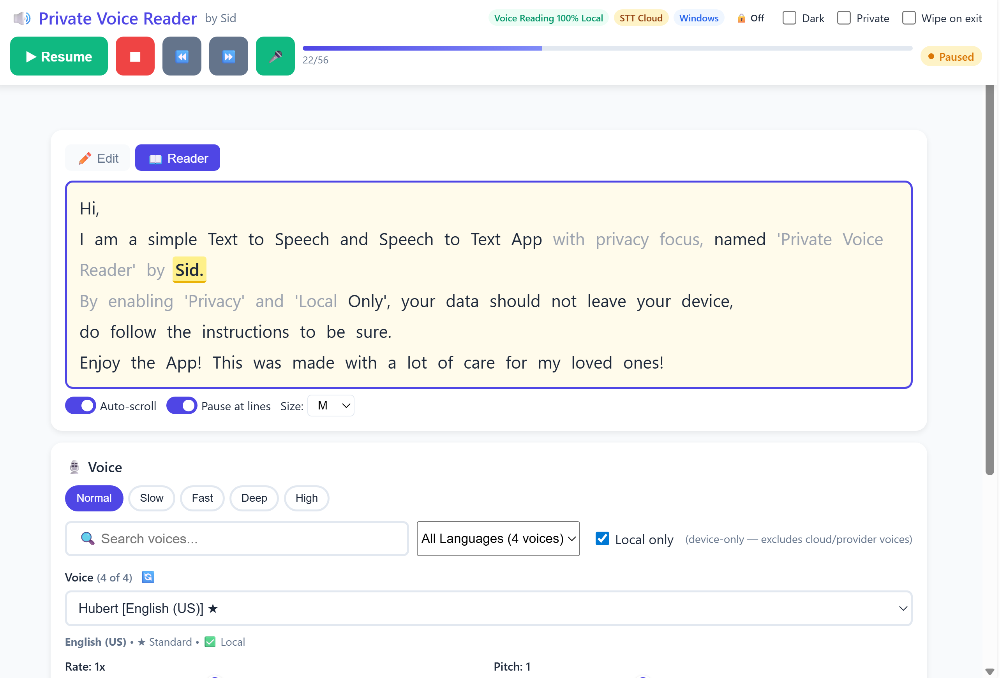
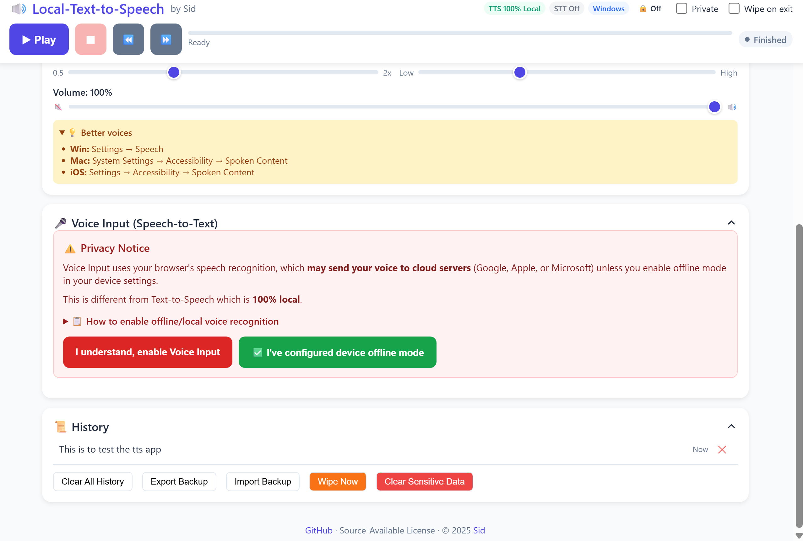

# 🔊 Local-Text-to-Speech & Voice Input by Sid

A privacy-focused, browser-based text-to-speech and voice input application.

**Privacy Model:**
- ✅ **Text-to-Speech (TTS)**: 100% local - no data ever leaves your device
- ⚠️ **Voice Input (STT)**: Disabled by default. When enabled, may use cloud servers unless you configure offline mode on your device

[](LICENSE)
[](https://github.com/sidbetatester)

**Repository:** [github.com/sidbetatester/Local-text-to-speech](https://github.com/sidbetatester/Local-text-to-speech)

## ✨ Features

### 🔊 Text-to-Speech (100% Local)
- **🔒 100% Private** - All processing happens in your browser. No data leaves your device.
- **📝 Rich Text Support** - Paste from Word, Google Docs, websites - formatting preserved!
- **🎙️ Multiple Voices** - Access all voices installed on your system
- **🔍 Voice Search** - Quickly find voices by name or language
- **🌍 Language Filter** - Filter voices by language
- **⚡ Real-time Controls** - Adjust rate, pitch, and volume while speaking
- **📖 Reader View** - Follow along with word-by-word highlighting, always in sync
- **⏸️ Pause at Lines** - Natural pauses at paragraph and line breaks (toggleable)
- **📁 File Upload** - Load text from TXT, MD, HTML, CSV, JSON, XML files
- **📜 History** - Quick access to recently spoken text
- **▶️ Smart Play** - One button handles play, pause, resume, and selected text with status hints
- **⏪ Rewind/Skip** - Jump back or forward 5 words, or click any word to jump
- **⌨️ Keyboard Shortcuts** - Space to play/pause, Escape to stop, arrows to skip
- **📱 Cross-Platform** - Works on Windows, macOS, iOS, Android, ChromeOS
- **🎨 Presets** - Quick settings for Normal, Slow, Fast, Deep, and High voices
- **🔧 Formatting Toolbar** - Bold, italic, underline, lists, headings, quotes

### 🎤 Voice Input (Speech-to-Text)
- **🔒 Disabled by Default** - Must explicitly enable after reading privacy notice
- **🎤 Voice to Text** - Speak and your words appear in the editor
- **🌐 Multi-language** - Supports 12+ languages
- **📝 Continuous Mode** - Keep listening for ongoing dictation
- **✅ Offline Mode Option** - Configure offline mode on your device where supported (the app cannot verify the browser processing path)
- **⌨️ Quick Access** - Press M key or click 🎤 button (after enabling)
- **🏷️ Status Badge** - Shows "STT Off", "STT Cloud", or "STT Offline Selected"

## Screenshots

### Text Editor


### Reader View


### Voice Input Privacy Notice and History Management


## 🚀 Quick Start

### Option 1: Direct Use
1. Download `index.html` from this folder
2. Open it in any modern browser
3. Start typing or paste text
4. Click Play

### Option 2: Host Online
See [Hosting](#-hosting) section below.

## 🎮 Usage

### Basic Controls
| Control | Action |
|---------|--------|
| ▶ Play / ⏸ Pause | Smart toggle - see below |
| ⏹ Stop | Stop speaking |
| ⏪ Rewind | Jump back 5 words |
| ⏩ Forward | Skip ahead 5 words |
| 🎤 Mic | Start/stop voice input |

### Smart Play Button
The Play button intelligently handles all scenarios:

| Situation | What Happens | Status Shows |
|-----------|--------------|--------------|
| Text is selected | Speaks only the selection | `▸ Selection` |
| Currently paused | Resumes from where you paused | `Resuming` |
| Currently playing | Pauses playback | `Paused` |
| Nothing selected | Starts from the beginning | `▸ Full text` |
| Click word in Reader | Starts from that word | `▸ From word X` |

### Keyboard Shortcuts
| Key | Action |
|-----|--------|
| `Space` | Toggle Play / Pause |
| `Escape` | Stop (TTS and Voice Input) |
| `←` | Rewind 5 words |
| `→` | Skip forward 5 words |
| `M` | Toggle Voice Input |

### Voice Settings
- **Rate** - Speaking speed (0.5x to 2x)
- **Pitch** - Voice pitch (Low to High)
- **Volume** - Audio volume (0% to 100%)

### Reader View
- Switch to Reader tab to see word-by-word highlighting
- **Always in sync** - Uses word matching to stay aligned with speech
- **Formatting preserved** - bold, italic, headings, lists all display properly
- **Click any word** to jump to that position and start reading
- **Pause at lines** toggle - adds natural pauses at line/paragraph breaks
- Auto-scroll follows the current word
- Adjust font size (S/M/L/XL)

### Voice Input (Speech-to-Text)

**Privacy First:** Voice Input is disabled by default because it may send voice data to cloud servers.

**To enable:**
1. Expand the "🎤 Voice Input" section
2. Read the privacy warning
3. Choose one of:
   - **"I understand, enable Voice Input"** - Enables STT (may use cloud)
   - **"✅ I've configured device offline mode"** - Enables STT with an offline-selected indicator

**After enabling:**
- Click 🎤 or press `M` to start speaking
- Your words will appear in the editor
- Badge shows: `STT Off` / `STT Cloud` / `STT Offline Selected`

**Options:**
- **Keep listening** - Continue recording after pauses (for long dictation)
- **Language** - Select from 12+ languages or auto-detect

**To disable:** Click "Disable Voice Input" at the bottom of the STT section.

**Making Voice Input 100% Local:**

By default, voice recognition may use cloud servers. To make it fully local:

| Platform | How to Enable Offline Mode |
|----------|---------------------------|
| **iOS 13+** | Settings → General → Keyboard → Enable Dictation → Enable "On-Device Dictation" |
| **macOS 12+** | System Settings → Keyboard → Dictation → Select "On-Device Only" |
| **Android** | Settings → Google → Voice → Offline Speech Recognition → Download your language |
| **Windows 11** | Settings → Privacy & Security → Speech → Turn OFF "Online speech recognition" |
| **Windows 10** | Search "Windows Speech Recognition" → Complete setup wizard |

⚠️ **Note:** Without offline mode enabled, voice data may be sent to Google (Chrome/Android) or Apple (Safari/iOS/macOS) for processing.

### Rich Text Support
The editor preserves formatting when you paste from:
- Microsoft Word
- Google Docs
- Web pages
- Emails
- PDF (copy/paste)

**Preserved formatting:**
- Bold, italic, underline
- Headings (H1, H2, H3)
- Bullet and numbered lists
- Blockquotes
- Links (displayed, not clickable in TTS)

**Toolbar buttons:**
| Button | Function |
|--------|----------|
| **B** | Bold |
| *I* | Italic |
| U̲ | Underline |
| • | Bullet list |
| 1. | Numbered list |
| H | Heading |
| " | Blockquote |
| ✕ | Clear formatting |

**Plain Text Mode:** Click "Plain Text" button to strip formatting when pasting.

### File Upload
Supported formats:
- `.txt` - Plain text
- `.md` - Markdown
- `.html` - HTML (tags stripped)
- `.csv` - CSV data
- `.json` - JSON files
- `.xml` - XML files

Maximum file size: 5MB

## Hosting Free Options for my reference
- Vercel
- Cloudflare Pages
- Render
- Surge.sh
- Netlify
- GitHub Pages 

## 🔐 Privacy & Security

### Data Privacy
- ✅ No data collection
- ✅ No analytics or tracking
- ✅ No external API calls
- ✅ No cookies (except localStorage for settings)
- ✅ All processing is local to your browser

### Security
- ✅ No external scripts or dependencies
- ✅ XSS protected (all input is sanitized)
- ✅ No database or server-side code
- ✅ Safe to host publicly

### What's Stored Locally
The app uses browser localStorage to save:
- Voice preference
- Rate, pitch, volume settings
- Recent history (last 15 items)

This data never leaves your device and can be cleared anytime.

## 🖥️ Browser Compatibility

| Browser | Support |
|---------|---------|
| Chrome | ✅ Full |
| Edge | ✅ Full |
| Safari | ✅ Full |
| Firefox | ✅ Full |
| Opera | ✅ Full |
| iOS Safari | ✅ Full (with minor limitations) |
| Android Chrome | ✅ Full |

### Platform Notes
- **Windows** - Best voice selection with installed TTS voices
- **macOS** - High-quality system voices available
- **iOS** - Works well; pause/resume may be slightly unreliable
- **Android** - Works with device voices

## 💡 Tips for Better Voices

### Windows
Settings → Time & Language → Speech → Add voices

### macOS
System Settings → Accessibility → Spoken Content → System Voice → Manage Voices

### iOS
Settings → Accessibility → Spoken Content → Voices

### Android
Settings → Accessibility → Text-to-speech output

## 📝 License

This project is licensed under the **Local-Text-to-Speech Source-Available License v1.0**.

This means:
- Source code is available to view and study.
- Personal, non-commercial use of unmodified copies is allowed.
- Modification, redistribution, public hosting, and commercial use require prior written permission.
- Attribution and license notices must be preserved.

See the [LICENSE](LICENSE) file for details.

**Copyright © 2025 Sid ([@sidbetatester](https://github.com/sidbetatester))**

## 🤝 Contributing

Contributions are welcome! Feel free to:
- Report bugs
- Suggest features
- Submit pull requests

## 📋 Changelog

### v1.3.2
- **Privacy First**: Voice Input (STT) now disabled by default
- Added: Privacy warning that must be acknowledged before enabling STT
- Added: Two enable options - "I understand" (cloud) or "I've enabled offline mode" (local)
- Added: Clear badge indicators showing STT status (Off / Cloud / Local)
- Added: "Disable Voice Input" button to turn it off after enabling
- Added: STT state saved to localStorage (persists between sessions)
- Improved: M keyboard shortcut opens STT section if not enabled

### v1.3.1
- Improved: Voice dropdown now shows language/locale (e.g., "English (US)", "English (UK)")
- Improved: Voice info display shows locale, quality rating, and if it's local or network
- Improved: Language filter shows readable names with voice counts
- Improved: Voice search now searches locale names too (try "british" or "australia")
- Added: 🔄 Refresh button to reload voices if some are missing
- Added: More retry attempts for loading voices on Apple devices
- Fixed: No-speech error now continues listening instead of stopping

### v1.3.0
- Added: Voice Input (Speech-to-Text) feature
- Added: 🎤 button to start/stop voice input
- Added: M keyboard shortcut for voice input
- Added: Continuous mode for ongoing dictation
- Added: Multi-language support (12+ languages)
- Added: Detailed setup guide for offline voice recognition on all platforms
- Added: Interim results display while speaking

### v1.2.6
- Improved: Word sync now uses word content matching instead of character position
- Fixed: Handles special characters like parentheses, underscores in code snippets
- Fixed: Self-corrects when sync drifts by matching spoken word to display word
# 🔊 Local-Text-to-Speech & Voice Input — v1.6-experimental

Privacy-first, single-file browser TTS + optional local STT (experimental).

**Quick privacy summary:**
- ✅ TTS (speechSynthesis) is fully local — audio is generated by your device
- ⚠️ STT (SpeechRecognition) is disabled by default and may be cloud-backed unless you enable on-device/offline speech on your platform

[](LICENSE)

## What's new in v1.6-experimental
- Inline input sanitizer (compact allowlist implementation) sanitizes pasted HTML, paste-button HTML, HTML uploads, and Markdown conversion before insertion
- Optional local encryption of stored data using Web Crypto (PBKDF2 -> AES-GCM)
- Passphrase verification blob prevents false unlocks with the wrong passphrase
- Encrypted storage layout: `enc_meta` (metadata) + per-item blobs at keys prefixed with `enc:` (for example `enc:ttsHistory`)
- Sensitive keys (`ttsSettings`, `ttsHistory`, `sttState`) use one storage wrapper; when encryption is enabled they are not written as plaintext
- Private Mode now prevents history persistence entirely instead of storing transcript previews
- Export / Import backup UI supports encrypted `enc:*` bundles and plaintext backups when encryption is disabled
- PBKDF2 runs through an inline Web Worker with an honest elapsed-time status and a main-thread fallback
- Wipe-on-exit uses a synchronous storage wipe path and is documented as best-effort
- Single-file distribution with frozen CSP hashes provided below

## Important Security & Recovery Notes
- Passphrase is the only way to decrypt your encrypted data. If you forget it, data is unrecoverable.
- Clearing browser storage or uninstalling the browser may remove encrypted blobs and make them unrecoverable.
- Wipe-on-exit is destructive by design but best-effort. Crashes, force-quit, mobile app lifecycle, browser restore, and back-forward cache can retain data.
- Voice Input uses browser `SpeechRecognition`. The app can record that you selected device offline mode, but it cannot verify whether the browser/OS actually processes speech locally.

## How encryption works (brief)
- Derivation: PBKDF2 with SHA-256 and a per-install salt stored in `enc_meta`
- Default iterations: `150000`
- Cipher: AES-GCM 256-bit, unique IV per encrypted blob, with associated data bound to the logical storage key
- Storage: encrypted JSON blobs are base64-encoded and saved under `enc:<key>`; `enc_meta` stores salt, version, iteration count, and creation time
- Runtime: the derived `masterKey` is kept in-memory only; locking or clearing the page clears it
- Unlock verification: `enc:__verify` must decrypt successfully before the app reports storage as unlocked

## Developer notes (storage keys & migration)
- `enc_meta` contains salt (base64), iterations, version, and creation time
- `ttsPrivacyPrefs` is intentionally plaintext and only stores `privateMode` and `wipeOnExit` so privacy preferences can be enforced before encrypted state is unlocked
- Encrypted blobs use keys of the form `enc:<originalKey>` such as `enc:ttsHistory`, `enc:ttsSettings`, and `enc:sttState`
- On enable: plaintext keys are encrypted, verified, then removed
- To completely reset encryption, use Reset or Clear Sensitive Data; both remove `enc_meta` and all `enc:` keys

## Backup / Export
- Export Backup creates a versioned JSON bundle with `format: local-tts-backup`
- Encrypted backups include `enc_meta` and every `enc:*` blob; import validates the passphrase before replacing current storage
- Plaintext backups are allowed only when encryption is disabled and include a warning before export/import
- Imported backups replace current stored history, settings, STT state, encryption metadata, and encrypted blobs after confirmation

## CSP deployment story
- This distribution is single-file and contains one inline style block plus two inline scripts. The PBKDF2 worker is created from a `Blob`, so strict CSP needs `worker-src 'self' blob:`.
- Current frozen hashes for `v1.6-experimental/index.html`:

```text
style-src  'sha256-ghWCkruA05TSN3MEvxDe4UwtIGWxOSo4QSG9FxDmYlo='
script-src 'sha256-/hx6zJYYeCi/3TL4znAxcCoNRdrudBla1pZwG1Fe3xw=' 'sha256-5q4HVccPii38bO2TnHZW7HUGHzgEMjHuhK0R2PnkS08='
```

Example header:

```text
Content-Security-Policy: default-src 'self'; script-src 'self' 'sha256-/hx6zJYYeCi/3TL4znAxcCoNRdrudBla1pZwG1Fe3xw=' 'sha256-5q4HVccPii38bO2TnHZW7HUGHzgEMjHuhK0R2PnkS08='; style-src 'self' 'sha256-ghWCkruA05TSN3MEvxDe4UwtIGWxOSo4QSG9FxDmYlo='; worker-src 'self' blob:; img-src 'self' data:; connect-src 'self';
```

Any change inside the style block or either script block requires recomputing the matching hash.

## UI & UX
- Encryption unlock/enable modal reachable from the lock icon. Options include enabling encryption (create passphrase) and unlocking with an existing passphrase.
- Reset encryption button appears in the modal when `enc_meta` exists — it asks for confirmation before deleting encrypted data.
- Private Mode toggle prevents history persistence.
- History includes Export Backup, Import Backup, Wipe Now, Clear All History, and Clear Sensitive Data actions.

## Limitations & Recommendations
- Passphrase loss is catastrophic; export encrypted backups before relying on stored data.
- Wipe-on-exit is a convenience feature, not a secure erase guarantee.
- The sanitizer is a compact allowlist, not the full DOMPurify library. It removes unsupported tags, drops unsafe URLs, removes image tags from sanitized content, and adds `rel="noopener noreferrer"` for pasted links opened in a new tab.
- Firefox does not provide stable `SpeechRecognition`; Voice Input is primarily Chrome, Edge, and Safari dependent.
- Microphone and clipboard features require HTTPS or localhost. Opening the file with `file://` supports TTS but not all STT/clipboard flows.

## Manual verification checklist
- TTS play, pause, stop, smart play, rewind/forward, and reader click-to-seek
- Paste and upload hostile HTML/Markdown
- Enable encryption, reload locked, try wrong passphrase, unlock with correct passphrase
- Add, delete, and clear history while encrypted storage is unlocked
- Private Mode confirms no persisted history
- Export/import encrypted backup and plaintext backup
- Wipe Now and wipe-on-exit on normal navigation/close
- STT on localhost or HTTPS, including unsupported-browser behavior
- CSP-hosted page loads with the hashes above

## Changelog (high level)
### v1.6-experimental
- Added: inline sanitizer, encrypted localStorage (Web Crypto), passphrase modal, and passphrase verification
- Added: `enc_meta` + `enc:` storage format with verified migration from plaintext keys
- Added: encrypted/plaintext backup export and import
- Changed: history and STT state now use the unified storage wrapper instead of direct plaintext writes
- Changed: Private Mode no longer persists history previews
- Changed: wipe-on-exit uses synchronous storage removal and is documented as best-effort
- Added: frozen CSP hashes for strict static hosting

---

Made with ❤️ by [Sid](https://github.com/sidbetatester) privacy-first local TTS experimental build
